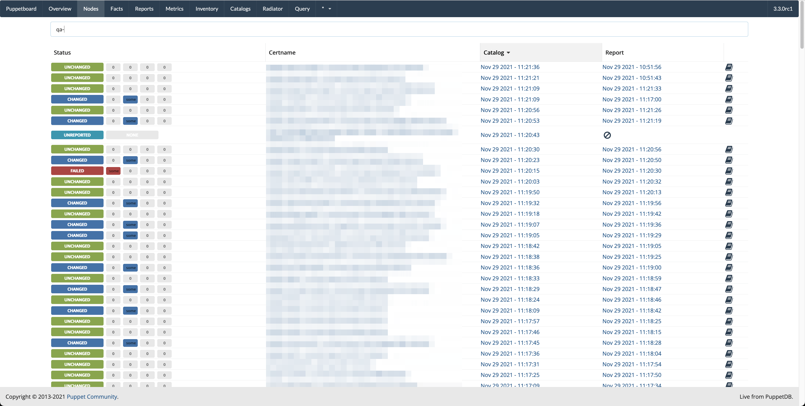
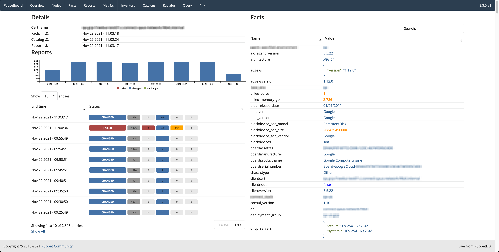
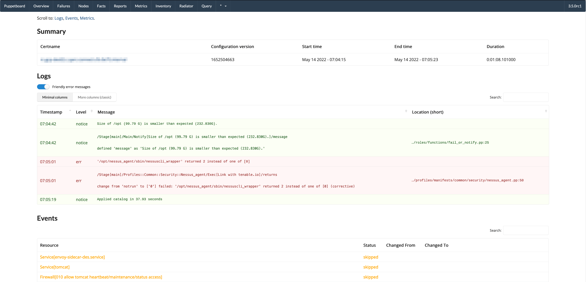
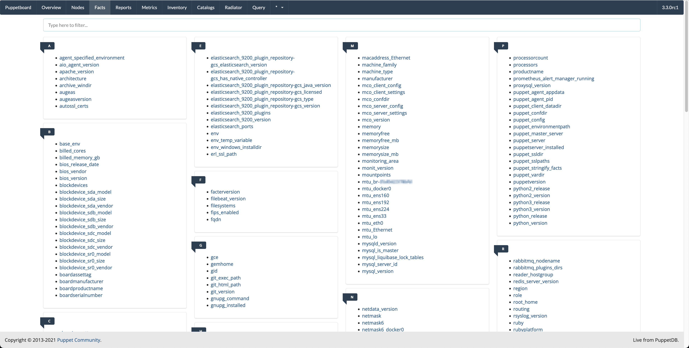
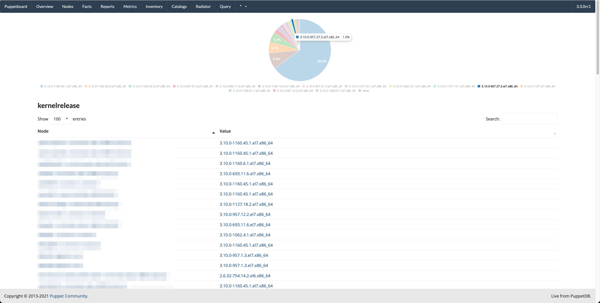
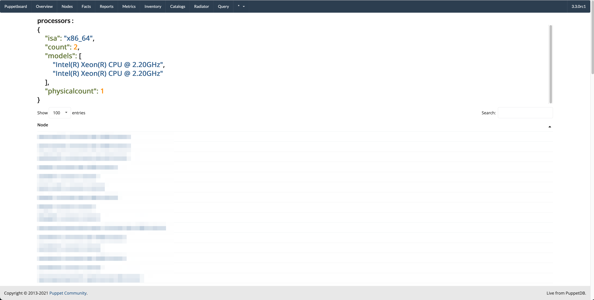
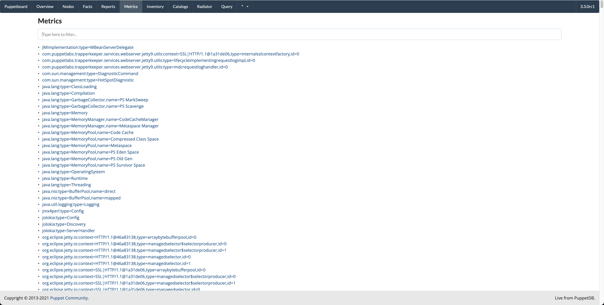
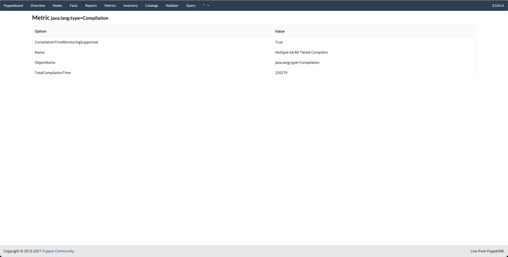

# Puppetboard

[](https://pypi.org/project/puppetboard/)
[](https://pypi.org/project/puppetboard/)
/badge.svg)
[](https://coveralls.io/r/voxpupuli/puppetboard)
[](http://voxpupuli.org)


Puppetboard is a web interface to [PuppetDB](https://puppet.com/docs/puppetdb/latest/index.html) aiming to replace
the reporting functionality of [Puppet Enterprise console (previously: Puppet Dashboard)](https://puppet.com/docs/pe/latest/console_accessing.html)
for the open source Puppet.


(See [more screenshots here](#more-screenshots).)

## Table of Contents

* [Requirements](#requirements)
* [Installation](#installation)
* [Configuration](#configuration)
* [Getting Help](#getting-help)
* [Contributing](#contributing)

## Requirements

* PuppetDB v. 3.0-6.0 (it may work with newer but this has not been verified)
* Python 3.6/3.7/3.8

## Installation

Puppetboard is packaged and available on PyPi.

### With Puppet module

There is a [Puppet module](https://forge.puppetlabs.com/puppet/puppetboard) originally written by
 [Spencer Krum](https://github.com/nibalizer) and currently maintained by [Voxpupuli](https://voxpupuli.org/)
that takes care of installing the Puppetboard for you.

To see how to get it working with RedHat/Centos 7 check out these [docs](https://github.com/voxpupuli/puppetboard/blob/master/docs/EL7.md).

### From a package

Actively maintained packages:

<table>
<colgroup>
<col width="25%" />
<col width="15%" />
<col width="58%" />
</colgroup>
<thead>
<tr class="header">
<th align="left">OS</th>
<th align="left">Status</th>
<th align="left"></th>
</tr>
</thead>
<tbody>
<tr class="even">
<td align="left"><a href="https://cvsweb.openbsd.org/cgi-bin/cvsweb/ports/www/puppetboard/">OpenBSD</a></td>
<td align="left">available</td>
<td align="left">Maintained by <a href="https://github.com/buzzdeee">Sebastian Reitenbach</a></td>
</tr>
</tbody>
</table>

### Using Docker

Please see [camptocamp/puppetboard on DockerHub](https://hub.docker.com/r/camptocamp/puppetboard) for a maintained
Docker image with the app.

We also provide the Dockerfile so you can build the image yourself. You can build it and run it with:

 ``` {.sourceCode .bash}
 $ docker build -t puppetboard .

 $ docker run -it -p 9080:80 -v /etc/puppetlabs/puppet/ssl:/etc/puppetlabs/puppet/ssl \
   -e PUPPETDB_HOST=<hostname> \
   -e PUPPETDB_PORT=8081 \
   -e PUPPETDB_SSL_VERIFY=/etc/puppetlabs/puppetdb/ssl/ca.pem \
   -e PUPPETDB_KEY=/etc/puppetlabs/puppetdb/ssl/private.pem \
   -e PUPPETDB_CERT=/etc/puppetlabs/puppetdb/ssl/public.pem \
   -e INVENTORY_FACTS='Hostname,fqdn, IP Address,ipaddress' \
   -e ENABLE_CATALOG=True \
   -e GRAPH_FACTS='architecture,puppetversion,osfamily' \
   puppetboard
```

### Manually

To install it simply issue the following command:

``` {.sourceCode .bash}
$ pip install puppetboard
```

This will install Puppetboard and take care of the dependencies. If you do this Puppetboard will be installed in the so 
called site-packages or dist-packages of your Python distribution.

The complete path on Debian and Ubuntu systems would be `/usr/local/lib/pythonX.Y/lib/dist-packages/puppetboard`
and on Fedora would be `/usr/lib/pythonX.Y/site-packages/puppetboard` where `X` and `Y` are replaced by your major
and minor python versions.

You will need this path in order to configure your HTTPD and WSGI-capable application server.

Please see [an article about more deployment setups here](https://github.com/voxpupuli/puppetboard/docs/Deployment-setups.md).

## Configuration

### PuppetDB

Of course you need to configure your Puppet Server to store the Puppet run reports in PuppetDB.
If you haven't done that already please follow the [PuppetDB documentation](https://puppet.com/docs/puppetdb/latest/connect_puppet_server.html)
about this.

If you run Puppetboard on a different host than PuppetDB then you may want to configure the certificate
allow-list for which certificates are allowed to access data from PuppetDB.
Please read more about this feature in the [PuppetDB documentation here](https://puppet.com/docs/puppetdb/latest/configure.html#certificate-allowlist).

### App settings

Puppetboard will look for a file pointed at by the `PUPPETBOARD_SETTINGS` environment variable.
The file has to be identical to
[default_settings.py](https://github.com/voxpupuli/puppetboard/blob/master/puppetboard/default_settings.py)
but should only override the settings you need changed.

If you run PuppetDB and Puppetboard on the same machine the default settings provided will be enough to get you started 
and you won't need a custom settings file.

Assuming your webserver and PuppetDB machine are not identical you will at least have to change the following settings:

-   `PUPPETDB_HOST`
-   `PUPPETDB_PORT`

By default PuppetDB requires SSL to be used when a non-local client wants to connect. Therefore you'll also have to
supply the following settings:

-   `PUPPETDB_SSL_VERIFY = /path/to/ca/keyfile.pem`
-   `PUPPETDB_KEY = /path/to/private/keyfile.pem`
-   `PUPPETDB_CERT = /path/to/public/keyfile.crt`

For information about how to generate the correct keys please refer to the 
[pypuppetdb documentation](https://pypuppetdb.readthedocs.io/en/latest/connecting.html#ssl). Alternatively it is possible
to explicitly specify the protocol to be used setting the `PUPPETDB_PROTO` variable.

Other settings that might be interesting:

#### General UI

*   `LOCALISE_TIMESTAMP`: Make the timestamps use the timezone provided by your browser. Defaults to `True`.
*   `REFRESH_RATE`: The number of seconds between automatic page refreshes. Defaults to `30`. Set to `0` to disable.
*   `DEFAULT_ENVIRONMENT`: The default value of the Puppet environment filter. Defaults to `'production'`. Set to `'*'`
    to show all environments.
*   `INVENTORY_FACTS`: A list of tuples that serve as the column header and the fact name to search for to create
    the inventory page. If a fact is not found for a node then `undef` is printed.
*   `ENABLE_QUERY`: If enabled then the Query tab is available which allows users to send arbitrary queries against
    a set of endpoints in PuppetDB. Defaults to `True`.
*   `ENABLED_QUERY_ENDPOINTS`: If `ENABLE_QUERY` is `True`, it allows restricting the list of the available endpoints.
    It must be a list of strings of PuppetDB endpoints for which the query is enabled. The default is empty, which
    means that all endpoints are allowed. See the `QUERY_ENDPOINTS` constant in `forms.py` for a list of the available
    endpoints.
*   `ENABLE_CATALOG`: If enabled then it allows the user to view a node's latest catalog. This includes all managed
    resources, their file-system locations and their relationships, if available. Defaults to `False`.

#### Overview page

*   `RESOURCES_STATS_ENABLED`: If set then the section with "Resources managed" and "Avg. resources/node"
    of the Overview page is shown. Defaults to `True`.
*   `DAILY_REPORTS_CHART_ENABLED`: Enable the use of daily chart graphs when looking at Overview and Node view.
     Defaults to `True`.
*   `DAILY_REPORTS_CHART_DAYS`: Number of days to show history for on the daily report graphs. Defaults to `8`.
*   `NODES_STATUS_DETAIL_ENABLED`: If set then such section of the Overview page is shown. Defaults to `True`.
*   `UNRESPONSIVE_HOURS`: The amount of hours since the last check-in after which a node is considered unreported.
    Defaults to `2`.

#### Lists of nodes (Overview and Nodes pages)

*   `WITH_EVENT_NUMBERS`: If set to `True` then Overview and Nodes list shows exact number of changed resources
    in the last report. Otherwise shows only 'some' string if there are resources with given status. Setting this
    to `False` gives performance benefits, especially in big Puppet environments (more than few hundreds of nodes).
    Defaults to `True`.
*   `DISPLAYED_METRICS`: Metrics to show as the node "Status", to the right of the last report result.
    Defaults to `['resources.total', 'events.failure', 'events.success', 'resources.skipped', 'events.noop']`.

#### Facts page

*   `GRAPH_FACTS`: A list of fact names to tell Puppetboard to generate a pie-chart on the fact page. With some fact
    values being unique per node, like ipaddress, uuid, and serial number, as well as structured facts it was no longer
    feasible to generate a graph for everything.
*   `GRAPH_TYPE`: Specify the type of graph to display. Default is pie, other good option is donut. Other choices
    can be found here: [C3.js examples](https://c3js.org/examples.html)

#### Various UI

*   `LITTLE_TABLE_COUNT`: Default number of reports to show when looking at a node. Defaults to `10`.
*   `NORMAL_TABLE_COUNT`: Default number of nodes to show when displaying reports and catalog nodes. Defaults to `100`.
*   `TABLE_COUNT_SELECTOR`: Configure the dropdown to limit number of hosts to show per page.
    Defaults to `[10, 20, 50, 100, 500]`.

#### Other

*   `PUPPETDB_TIMEOUT`: Defaults to 20 seconds but you might need to increase this value. It depends on how big the
    results are when querying PuppetDB. This behaviour will change in a future release when pagination will be introduced.
*   `LOGLEVEL`: A string representing the loglevel. It defaults to `'info'` but can be changed to `'warning'` or
    `'critical'` for less verbose logging or `'debug'` for more information.
*   `SECRET_KEY`: Refer to [Flask documentation](https://flask.palletsprojects.com/en/1.1.x/quickstart/#sessions),
    section "How to generate good secret keys" for more info. Defaults to a random 24-char string generated by
    `os.random(24)`.
*   `OFFLINE_MODE`: If set to `True` load static assets (jquery, semantic-ui, etc) from the local web server instead
    of a CDN. Defaults to `False`.
*   `DEV_LISTEN_HOST`: For use with dev.py for development. Default is localhost
*   `DEV_LISTEN_PORT`: For use with dev.py for development. Default is 5000

## Getting Help

For questions or bug reports you can file an [issue](https://github.com/voxpupuli/puppetboard/issues).

(Previously mentioned here methods of contacting the app maintainers are not used as of now anymore, sorry.)

## Contributing

### Development

Puppetboard relies on the [pypuppetdb](https://pypi.org/project/pypuppetdb/) library to fetch data from PuppetDB
and is built with the help of the [Flask](https://flask.palletsprojects.com) microframework.

If you wish to hack on Puppetboard you should fork/clone the Github repository and then install the requirements through:

``` {.sourceCode .bash}
$ pip install -r requirements-test.txt
```

You're advised to do this inside a virtualenv specifically created to work on Puppetboard as to not pollute your global Python installation.

You can run the app it in development mode by simply executing:

``` {.sourceCode .bash}
$ python dev.py
```

Use `PUPPETBOARD_SETTINGS` to change the different settings or patch `default_settings.py` directly.
Take care not to include your local changes on that file when submitting patches for Puppetboard.
Place a `settings.py` file inside the base directory of the git repository that will be used, if the environment
variable is not set.

We welcome contributions to this project. However, there are a few ground rules contributors should be aware of.

### License

This project is licensed under the Apache v2.0 License. As such, your contributions, once accepted, are automatically
covered by this license.

### Commit messages

Write decent commit messages. Don't use swear words and refrain from uninformative commit messages as 'fixed typo'.

The preferred format of a commit message:

    docs/quickstart: Fixed a typo in the Nodes section.

    If needed, elaborate further on this commit. Feel free to write a
    complete blog post here if that helps us understand what this is
    all about.

    Fixes #4 and resolves #2.

If you'd like a more elaborate guide on how to write and format your commit messages have a look at [this post
by Tim Pope](https://tbaggery.com/2008/04/19/a-note-about-git-commit-messages.html).

## More Screenshots

Up to date ones:


Older ones, may be a bit outdated:


















